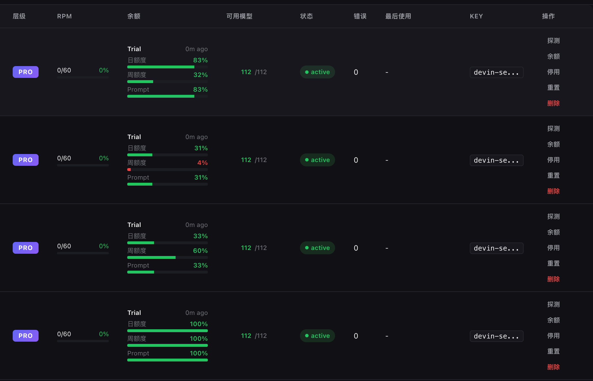
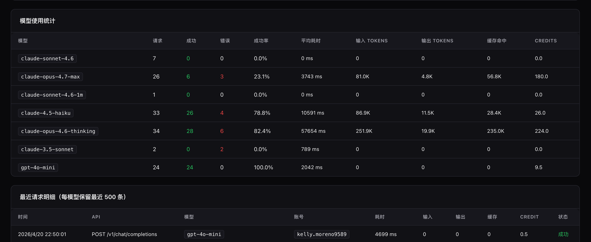

<p align="center">
  
  
  
  
  
  
</p>

<h1 align="center">WindsurfPoolAPI</h1>

<p align="center">
  <b>Enterprise-grade multi-account pool proxy for Windsurf AI platform.</b><br/>
  Expose 113+ models (Claude / GPT / Gemini / DeepSeek / Grok / Qwen / Kimi / GLM) via standard OpenAI & Anthropic APIs.<br/>
  <sub>Enterprise-grade Windsurf multi-account pool API proxy — 113+ models, OpenAI / Anthropic dual-protocol, native Cursor / Claude Code support</sub>
</p>

<p align="center">
  <a href="#-quick-start">Quick Start</a> ·
  <a href="#-features">Features</a> ·
  <a href="#-dashboard">Dashboard</a> ·
  <a href="#-api-reference">API Reference</a> ·
  <a href="#-deployment">Deployment</a> ·
  <a href="#-faq">FAQ</a>
</p>

---

## ⚠️ Disclaimer

This project is for **personal learning, research, and self-hosting only**. Commercial use, resale, paid deployment, or repackaging as a service without written authorization is **strictly prohibited**.

---

## ✨ Features

| Feature | Description |
| :--- | :--- |
| **Dual Protocol** | `/v1/chat/completions` (OpenAI) + `/v1/messages` (Anthropic native) |
| **113+ Models** | Claude Opus 4.7 · GPT-5.4 · Gemini 3.1 · DeepSeek R1 · Grok 3 · Qwen 3 · Kimi K2.5 · GLM-5.1 and more |
| **Multi-Account Pool** | Capacity-based load balancing, automatic failover, per-model rate-limit isolation |
| **Token & Credit Analytics** | Per-API × per-model aggregation down to individual request level |
| **Admin Dashboard** | Full-featured SPA: account management, proxy config, real-time logs, usage charts |
| **Batch Operations** | Select multiple accounts, enable/disable in one click |
| **OAuth Login** | Google / GitHub Firebase OAuth + manual token refresh |
| **Dynamic Stall Detection** | Input-length-aware timeout (30s–90s) prevents false positives on large contexts |
| **Persistent State** | All settings, account status, tokens survive restarts |
| **Image Upload** | Multimodal support — send images via `image_url` blocks (base64 or URL) |
| **Tool Calling** | `<tool_call>` protocol compatible — works with Cursor, Aider, and other AI coding tools |
| **Cursor Compatible** | 80+ model name aliases including Cursor-friendly names without "claude" keyword |
| **Streaming SSE** | OpenAI format with `stream_options.include_usage` support |
| **Zero Dependencies** | Pure Node.js built-in modules, nothing to install |


---

## 🚀 Quick Start

### Prerequisites

- **Node.js ≥ 20**
- **Windsurf Language Server** binary (`language_server_linux_x64` or `language_server_darwin_arm64`)
- At least one Windsurf account (Free tier supports limited models)

### Install & Run

```bash
git clone https://github.com/guanxiaol/WindsurfPoolAPI.git
cd WindsurfPoolAPI

# Place Language Server binary
sudo mkdir -p /opt/windsurf
sudo cp /path/to/language_server_linux_x64 /opt/windsurf/
sudo chmod +x /opt/windsurf/language_server_linux_x64

# Optional: configure
cp .env.example .env    # Edit API_KEY, DASHBOARD_PASSWORD, etc.

# Start
node src/index.js
```

> **macOS** — Run `bash scripts/install-macos.sh` for auto-start on login.
>
> **Windows** — Run `scripts\install-windows.bat` for guided installation.

Dashboard: `http://localhost:3003/dashboard`

### Docker

```bash
docker compose up -d --build
```

Mount the LS binary at `/opt/windsurf/` on the host before starting.

---

## 🔑 Account Management

> ⚠️ **Always use Token login!**
>
> Windsurf has a known bug where email/password login may route requests to the wrong account.
>
> **Get your token**: [https://windsurf.com/editor/show-auth-token?workflow=](https://windsurf.com/editor/show-auth-token?workflow=)

```bash
# ✅ Add account via Token (recommended)
curl -X POST http://localhost:3003/auth/login \
  -H "Content-Type: application/json" \
  -d '{"token": "your-windsurf-token"}'

# Batch add
curl -X POST http://localhost:3003/auth/login \
  -H "Content-Type: application/json" \
  -d '{"accounts": [{"token": "t1"}, {"token": "t2"}]}'

# List accounts
curl http://localhost:3003/auth/accounts

# Remove
curl -X DELETE http://localhost:3003/auth/accounts/{id}
```

---

## 📡 API Reference

### OpenAI Compatible

```bash
curl http://localhost:3003/v1/chat/completions \
  -H "Content-Type: application/json" \
  -H "Authorization: Bearer sk-your-api-key" \
  -d '{
    "model": "gpt-4o-mini",
    "messages": [{"role": "user", "content": "Hello!"}],
    "stream": false
  }'
```

### Anthropic Compatible

```bash
curl http://localhost:3003/v1/messages \
  -H "Content-Type: application/json" \
  -H "anthropic-version: 2023-06-01" \
  -H "x-api-key: sk-your-api-key" \
  -d '{
    "model": "claude-sonnet-4.6",
    "max_tokens": 1024,
    "messages": [{"role": "user", "content": "Hello!"}]
  }'
```

### Environment Variables

| Variable | Default | Description |
| :--- | :--- | :--- |
| `PORT` | `3003` | HTTP server port |
| `API_KEY` | _(empty)_ | Auth key for `/v1/*` endpoints. Empty = open access |
| `DASHBOARD_PASSWORD` | _(empty)_ | Dashboard admin password |
| `DEFAULT_MODEL` | `claude-4.5-sonnet-thinking` | Default model when none specified |
| `MAX_TOKENS` | `8192` | Default max output tokens |
| `LOG_LEVEL` | `info` | `debug` / `info` / `warn` / `error` |
| `LS_BINARY_PATH` | `/opt/windsurf/language_server_linux_x64` | Language Server path |
| `LS_PORT` | `42100` | Language Server gRPC port |

### Dashboard API

All endpoints require `X-Dashboard-Password` header.

| Method | Path | Description |
| :--- | :--- | :--- |
| `GET` | `/dashboard/api/overview` | System overview |
| `GET` | `/dashboard/api/accounts` | List all accounts |
| `POST` | `/dashboard/api/accounts/batch-status` | Batch enable/disable accounts |
| `POST` | `/dashboard/api/oauth-login` | OAuth login (Google/GitHub) |
| `POST` | `/dashboard/api/accounts/:id/refresh-token` | Refresh Firebase token |
| `POST` | `/dashboard/api/accounts/:id/rate-limit` | Check account capacity |
| `GET` | `/dashboard/api/usage` | Full usage statistics |
| `GET` | `/dashboard/api/usage/export` | Export stats as JSON |
| `POST` | `/dashboard/api/usage/import` | Import stats (auto-dedup) |
| `GET` | `/dashboard/api/logs/stream` | Real-time SSE log stream |

---

## 🖥 Dashboard

Access at `http://localhost:3003/dashboard`

| Panel | Description |
| :--- | :--- |
| **Overview** | Runtime stats, account pool health, success rate |
| **Login** | Windsurf token/email login, OAuth |
| **Accounts** | Add/remove, batch enable/disable, per-account proxy, quota display |
| **Models** | Global allow/blocklist, per-account model restrictions |
| **Proxy** | Global + per-account HTTP/SOCKS5 proxy |
| **Logs** | Real-time SSE log stream with level filtering |
| **Analytics** | Token/Credit charts, 14-day trends, 24h distribution, request details |
| **Detection** | Error pattern monitoring, account health |
| **Experimental** | Cascade session reuse, model identity masking, preflight rate-limit |

### Screenshots

<p align="center">
  <b>Account Pool — Multi-account quota monitoring</b><br/>
  
</p>

<p align="center">
  <b>Analytics — Token & Credit usage charts</b><br/>
  
</p>

<p align="center">
  <b>Model Stats — Per-model request breakdown</b><br/>
  
</p>

---

## 🤖 Supported Models

<details>
<summary><b>Claude (Anthropic)</b></summary>

`claude-3.5-sonnet` · `claude-3.7-sonnet[-thinking]` · `claude-4-sonnet[-thinking]` · `claude-4-opus[-thinking]` ·
`claude-4.1-opus[-thinking]` · `claude-4.5-sonnet[-thinking]` · `claude-4.5-haiku` · `claude-4.5-opus[-thinking]` ·
`claude-sonnet-4.6[-thinking][-1m]` · `claude-opus-4.6[-thinking]` · `claude-opus-4.7-{low,medium,high,xhigh,max}`

</details>

<details>
<summary><b>GPT (OpenAI)</b></summary>

`gpt-4o` · `gpt-4o-mini` · `gpt-4.1[-mini/nano]` · `gpt-5[-mini]` · `gpt-5.2[-low/medium/high]` ·
`gpt-5.4[-low/medium/high/xhigh]` · `gpt-5.3-codex` · `o3[-mini/high/pro]` · `o4-mini`

</details>

<details>
<summary><b>Gemini (Google)</b></summary>

`gemini-2.5-pro` · `gemini-2.5-flash` · `gemini-3.0-pro` · `gemini-3.0-flash` · `gemini-3.1-pro[-low/high]`

</details>

<details>
<summary><b>Others</b></summary>

`deepseek-v3` · `deepseek-r1` · `grok-3[-mini]` · `grok-code-fast-1` · `qwen-3` · `qwen-3-coder` ·
`kimi-k2` · `kimi-k2.5` · `swe-1.5[-thinking]` · `swe-1.6-fast` · `arena-fast` · `arena-smart`

</details>

> Model catalog is auto-synced from Windsurf cloud on startup. Free accounts: `gpt-4o-mini` and `gemini-2.5-flash` only.

---

## 🚢 Deployment

### PM2 (Recommended)

```bash
npm install -g pm2
pm2 start src/index.js --name windsurfpool --cwd /path/to/WindsurfPoolAPI
pm2 save && pm2 startup
```

### systemd (Linux)

```ini
# /etc/systemd/system/windsurfpool.service
[Unit]
Description=WindsurfPoolAPI
After=network.target

[Service]
Type=simple
User=windsurf
WorkingDirectory=/opt/WindsurfPoolAPI
ExecStart=/usr/bin/node src/index.js
Restart=on-failure
RestartSec=5
Environment=PORT=3003

[Install]
WantedBy=multi-user.target
```

```bash
sudo systemctl enable --now windsurfpool
```

### macOS (launchd)

```bash
bash scripts/install-macos.sh
```

### Firewall

```bash
# Ubuntu
sudo ufw allow 3003/tcp

# CentOS
sudo firewall-cmd --add-port=3003/tcp --permanent && sudo firewall-cmd --reload
```

> Cloud servers: remember to open port 3003 in your security group.

---

## 🏗 Architecture

```text
Client (OpenAI SDK / Anthropic SDK / curl / Cursor / Aider)
   │
   ▼
WindsurfPoolAPI  (Node.js HTTP, :3003)
   ├── /v1/chat/completions    (OpenAI format)
   ├── /v1/messages            (Anthropic format)
   ├── /dashboard/api/*        (Admin API)
   └── /dashboard              (Admin SPA)
   │
   ▼
Language Server Pool  (gRPC-over-HTTP/2, :42100+)
   │
   ▼
Windsurf Cloud  (server.self-serve.windsurf.com)
```

See `ARCHITECTURE.md` for module-level details.

---

## ❓ FAQ

**Q: `LS binary not found` on startup?**
A: Ensure the binary exists at `/opt/windsurf/language_server_linux_x64` (or set `LS_BINARY_PATH`).

**Q: `No accounts available`?**
A: Add at least one account via Dashboard or `POST /auth/login`.

**Q: `permission_denied` for all accounts?**
A: Free accounts only support `gpt-4o-mini` and `gemini-2.5-flash`. Other models require Windsurf Pro.

**Q: How to migrate stats between servers?**
A: Export: `GET /dashboard/api/usage/export` → Import: `POST /dashboard/api/usage/import` (auto-dedup).

**Q: How to update models?**
A: Models auto-sync on startup. Restart the service to refresh.

---

## 🤝 Contributing

See `CONTRIBUTING.md`. Issues and PRs are welcome.

---

## 🙏 Acknowledgements

This project is built upon [dwgx/WindsurfAPI](https://github.com/dwgx/WindsurfAPI). Special thanks to [@dwgx](https://github.com/dwgx) for the foundational work and open-source contribution.

---

## 📄 License

[MIT](LICENSE)
